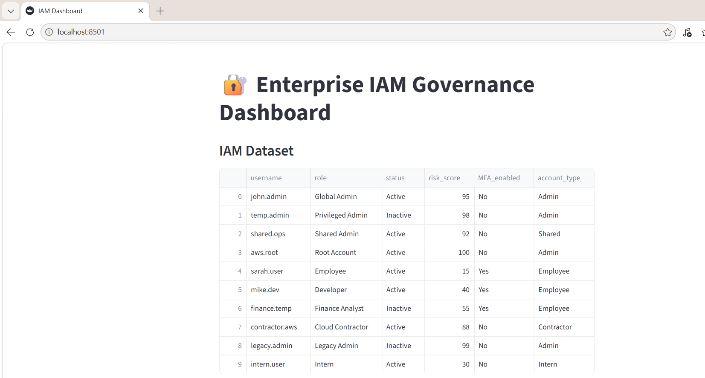
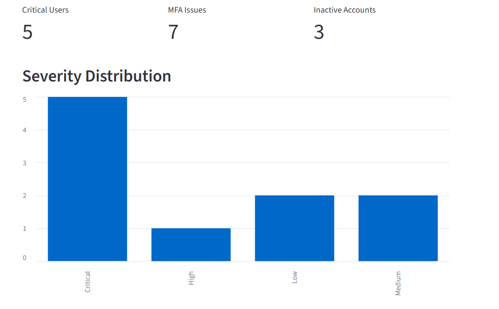
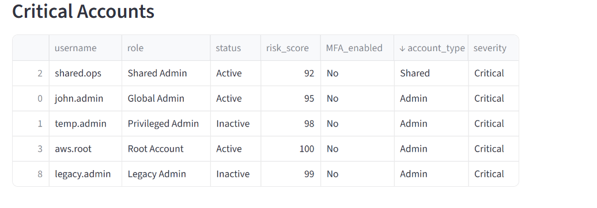

# IAM Governance Dashboard
## Overview
IAM Governance Dashboard is a Streamlit-based cybersecurity application designed to simulate Identity and Access Management (IAM) governance activities.
The dashboard analyses user access data and helps identify security risks such as privileged accounts, inactive users, dormant accounts, and Multi-Factor Authentication (MFA) compliance issues.

## Business Problem
Organizations often struggle to identify:
- High-risk privileged accounts
- Dormant users
- Accounts without MFA
- Inactive users with access rights
This project provides a centralized governance dashboard to improve visibility and support access review activities.

## Solution Workflow

CSV Upload
↓
Identity Data Analysis
↓
Risk Scoring
↓
Risk Classification
↓
Governance Dashboard
↓
Access Review Insights

## Features
✅ CSV Upload Support
✅ Dynamic Risk Scoring
✅ Privileged Account Identification
✅ MFA Compliance Monitoring
✅ Dormant Account Detection
✅ Inactive User Monitoring
✅ Search and Filtering
✅ Risk Metrics Dashboard

## Screenshots
### Dashboard Overview

### Severity Chart

### Critical Accounts View

## Technology Stack

| Technology | Purpose |
|------------|---------|
| Python | Core programming language used for data processing and IAM risk analysis |
| Streamlit | Interactive web dashboard |
| Pandas | Data ingestion and analysis |
| GitHub | Version control and portfolio hosting |
| Streamlit Cloud | Application deployment |

## Key IAM Concepts Demonstrated
- Identity Governance
- Access Reviews
- Risk-Based Access Certification
- Least Privilege Principle
- MFA Compliance
- User Lifecycle Management

## Sample Use Cases
- IAM Governance Reviews
- Internal Security Audits
- Quarterly Access Certification
- Compliance Monitoring

## Future Enhancements
- PDF governance report export for audit and compliance reviews
- Advanced filtering by role, department, and risk level
- Support for importing SailPoint and Saviynt access review reports
- Enhanced role-based risk scoring for privileged and business-critical accounts
